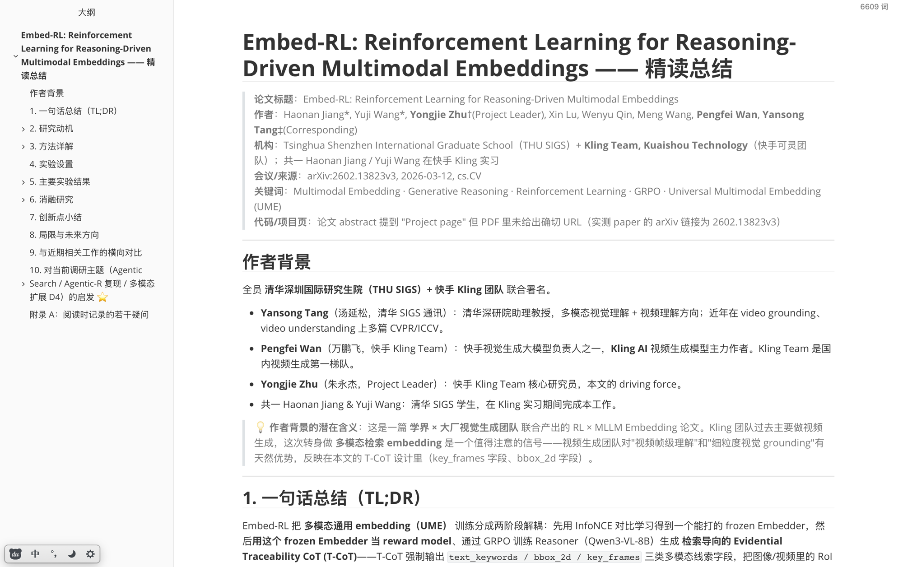

# writing-paper-deep-reads

> 让 Claude Code 把论文精读为一份可直接归档的结构化中文 markdown。

  



- 输入 PDF / arXiv，输出 `{论文简称} 论文精读总结.md`，结构、图、表、公式、启发段齐全。
- 严格的 11 节骨架 + 三条硬规矩（每图必解读、公式必直觉、末尾必启发）。
- 7 条 Pitfalls 烧自真实精读会话 —— 而不是脑补的最佳实践。

---

## ✨ Why this skill?

### 🦴 11 节模板的严格性

不是 "AI 写个 TL;DR" —— 是按固定 11 节骨架把论文骨头拆开：

1. 一句话总结 → 2. 研究动机 → 3. 核心思想 → 4. 方法详解 → 5. 实验设置 → 6. 主结果 → 7. 消融 → 8. 定性结果 → 9. 创新点小结 → 10. 局限 → 11. **对调研主题的启发**

三条硬规矩，绝对不省：

- ✅ 每张图必跟"图 N 解读"段（分点 + 关键洞察，不只 OCR caption）
- ✅ 每个公式必跟"直觉理解"段（把符号翻译成人话）
- ✅ 末尾必有"对当前调研主题的启发"段（具体怎么迁移到你的工作）

### ⚠️ 7 条 Pitfalls 的实战性

这些不是凭空的 best practice，是真实烧过 token 才知道的。比如：

> `call #4 cp` 成功，`call #13 cp` 必失败 —— Claude Code 的 image-cache 有 TTL，第一动作必须 `cp`，不能拖到读完 PDF 之后。

完整 7 条在 §7 Pitfalls。

---

## 📖 看产出

> 4 段节选，全部来自 [`examples/embed-rl-deep-read.md`](examples/embed-rl-deep-read.md)（论文：Jiang et al. 2026, *Embed-RL: Reinforcement Learning for Reasoning-Driven Multimodal Embeddings*）。

### 图解读样例

> **图 2 解读** —— 整张图分上下两块：
>
> - **(a) Data Construction（上）**：Original Data（text/image/video query + positive 各一份）→ 喂 **Qwen3-VL** 自动标注 T-CoT，输出包含 `<thinking>/<rethink>/<answer>` 三段，并附带 `Keywords` / `Key Objects (bbox)` / `Key Frames` → **T-CoT Filtering**：把 query T-CoT 和 positive T-CoT 一起再喂 Qwen3-VL，问 "is match?"，No 的扔掉、Yes 的保留 → 切 80/20：**80%→ Contrastive Learning Data**，**20%→ Reinforcement Learning Data**。
> - **(b) Embedder-Guided RL（下）**：MLLM Reasoner 接 Positive/Query/Negative triplet → 生成三路 T-CoT → 三路并行喂 Embedder（**Embedder frozen**）→ 算相似度 → Reward = Format + Process + Outcome → advantage 反传更新 Reasoner，跟 Reference Model 做 KL。

### 公式 + 直觉理解样例

> #### Policy Optimization：GRPO
>
> $$\mathcal{L}_{\text{grpo}} = \mathbb{E}_{q\sim\mathcal{S},\ \{o_i\}\sim\pi_{\theta_{\text{old}}}}\Big[\frac{1}{G}\sum_{i=1}^G \big(\min(r_\theta(o_i)A_i,\ \text{clip}(r_\theta(o_i),1-\epsilon,1+\epsilon)A_i) - \beta\mathbb{D}_{\text{KL}}(\pi_\theta\|\pi_{\text{ref}})\big)\Big]$$
>
> **直觉理解**：标准 DeepSeek-style GRPO —— 每个 query 采样 G=8 条 T-CoT 候选，按组内 reward 算 advantage $A_i = (r_i - \mu_r)/\sigma_r$，拿 PPO-style clipped objective + KL 约束更新 policy。**没有 critic / value model**，纯 group-relative 比较，这是 GRPO 相比 PPO 最省资源的地方。

### 主结果表（最佳行加粗）

> | 模型 | Image-Overall | Video-Overall | VisDoc-Overall | **All** |
> |---|---:|---:|---:|---:|
> | GME-7B | 56.0 | 38.6 | 75.2 | 57.8 |
> | VLM2Vec-V2-7B | 68.1 | 36.4 | 69.3 | 61.2 |
> | UME-R1-7B | 71.3 | 47.5 | 67.1 | 64.5 |
> | **Embed-RL-2B (Ours)** | 69.2 | **52.1** | 74.1 | **66.8** |
> | **Embed-RL-4B (Ours)** | **70.1** | **53.0** | **74.7** | **68.1** |
>
> **关键发现**：
>
> 1. **Embed-RL-4B All=68.1，超过最强 baseline UME-R1-7B 3.6 个点，且模型规模更小（4B vs 7B）** —— 用一半参数实现明显领先。
> 2. **Video 提升最显著**：Embed-RL Video Overall 53.0，比 UME-R1-7B 的 47.5 高 5.5 个点。**直接归功于 T-CoT 的 keyframe 字段** —— video 任务被多帧 noise 拖累最严重，能精确选关键帧的模型大赢。

### 对当前调研主题的启发样例

> 1. **T-CoT 的 schema 可作多模态 SFT 的现成蓝图** ⭐⭐⭐
>    - 如果你的调研里有一项是"如何让 reasoning trace 利用上图像/视频信息"，Embed-RL 的 `text_keywords / bbox_2d / key_frames` 三字段就是一个非常 actionable 的 schema。
>    - **可直接搬到你的多模态 SFT 数据格式里**：thinking 段强制输出 cue 字段、rethink 段做反思、answer 段给最终描述。

完整 11 节范例 → [`examples/embed-rl-deep-read.md`](examples/embed-rl-deep-read.md)

---

## 🚀 Quick Start

```bash
# 1. 克隆到 user-level skills 目录
cd ~/.claude/skills
git clone https://github.com/RemRico/writing-paper-deep-reads.git
```

```bash
# 2. 安装依赖（仅当你想用 scripts/crop_figure.py 时需要）
brew install poppler                 # macOS：提供 pdftoppm
# Linux: sudo apt install poppler-utils
pip install Pillow
```

```text
# 3. 在 Claude Code 里触发（任意一种）
> 帮我精读这篇论文 [拖入 PDF]
> 精读这篇：/path/to/paper.pdf
> 精读 arXiv: 2401.xxxxx
```

```text
# 4. 在 PDF 同目录看到：
{论文简称} 论文精读总结.md
images/{paper-slug}-fig*.png
```

想先看成品？打开 [`examples/embed-rl-deep-read.md`](examples/embed-rl-deep-read.md)。

---

## 📋 11 节模板速览

| 节 | 必填字段 |
|---|---|
| 1. 一句话总结 (TL;DR) | 1-3 句话精炼 |
| 2. 研究动机 | 问题陈述 + 核心洞察 |
| 3. 核心思想 / 方法概览 | Figure 1（含解读） |
| 4. 方法详解 | 分 Stage / 子模块 + 公式 + 直觉理解 |
| 5. 实验设置 | 数据集 / Backbone / Benchmark / 指标 |
| 6. 主要实验结果 | 主表 + 关键发现 |
| 7. 消融研究 | 维度 × 一句话结论 |
| 8. 定性结果 / 可视化 | 含可视化图 + 解读 |
| 9. 创新点小结 | 编号 + 一句话 |
| 10. 局限与未来方向 | bullet |
| 11. 对调研主题的启发 ⭐ | 必针对当前调研主题，具体怎么迁移 |

完整模板与裁剪指引 → [`template.md`](template.md)

---

## 🖼 3 种图片来源模式

| 模式 | 触发 | 主要动作 |
|---|---|---|
| **A. 用户附图**（主力） | 你在消息里附了图 | 第一动作立刻 `cp` 出 image-cache → 视觉匹配 → 重命名 |
| **B. 自动抽图** | 你没附图 | `scripts/crop_figure.py PDF PAGE --out images/...` |
| **C. 混合** | 你附了部分 | A + B 并集；缺图默认 TODO 让你决定 |

**为什么模式 A 要"第一动作 cp"？** image-cache 有 TTL，第一个 Bash 之后才 `cp` 就会丢图 —— 详见 §7 第二条 Pitfall。

---

## ⚠️ Pitfalls（精选 3 条）

### 🔴 Read 工具对 PNG 有渲染缓存错位

**现象**：裁好图存到 `images/`，再用 Read 检查时，preview 与磁盘 md5 不符。会导致反复怀疑裁剪坐标错了 → 重裁 → 再 Read → 又不对，循环 8-10 轮。

**对策**：永远不要把 Read 的 image preview 当 ground truth。校验用 `file size + md5`（`crop_figure.py` 会自动打印 md5）。

### 🔴 用户附图的 image-cache 有 TTL —— 必须第一时间 cp

**现象**：`~/.claude/image-cache/{session-id}/*.png` 实测有 TTL。`call #4 cp` 成功，`call #13 cp` 失败（PDF 读取这种重 IO 会拖到超期）。

**对策**：接到附图请求后，**第一个 Bash 立刻 `cp`**，PDF 读取放后面。顺序错了就丢图。

### 🟢 单次 Write 长度限制 —— 长文必分段

**现象**：完整精读文档常 > 250 行、> 8k 字，单次 Write 可能超长报错。

**对策**：分段写。首次 Write 写头部 + 1-2 节 + 末尾 sentinel 注释 `<!-- [后续章节] -->`；用 Edit 替换 sentinel 接续；最后一轮替成空。

---

看全部 7 条 → [`SKILL.md`](SKILL.md)

---

## 🛠 Conventions（命名 / 结构）

**文件命名**
- 主文件：`{论文简称} 论文精读总结.md`，与 PDF 同目录
- 简称来源：论文 propose 的方法名；否则第一作者姓 + 关键词

**图片**
- `images/{paper-slug}-fig{N}.png`，slug 小写连字符
- 编号 `fig{N}` 对应**论文 Figure N**（不是用户给图的顺序 `img1` / `img2`）

**元信息样式（blockquote）**
- 标题 / 作者+机构 / 会议或 arXiv / 关键词 四行
- 如需为某位研究者补充身份、背景或别名（同公司同事、知名学者等），可在元信息加粗或括注，便于日后辨识

**文风标记**：⭐ 关键设计 · ⚠️ 易踩坑 · 📘 前置课 · ✅ / ❌ 对比

---

## 📄 License + Credit

[MIT License](LICENSE) —— 自由 fork、修改、商用。

如果这个 skill 帮到你，给个 star ⭐ 就是最好的反馈。
Issue / PR welcome —— 特别欢迎补充新的 Pitfalls。
