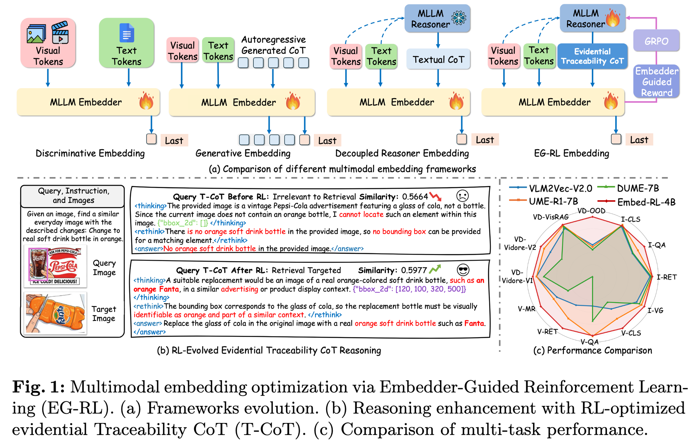
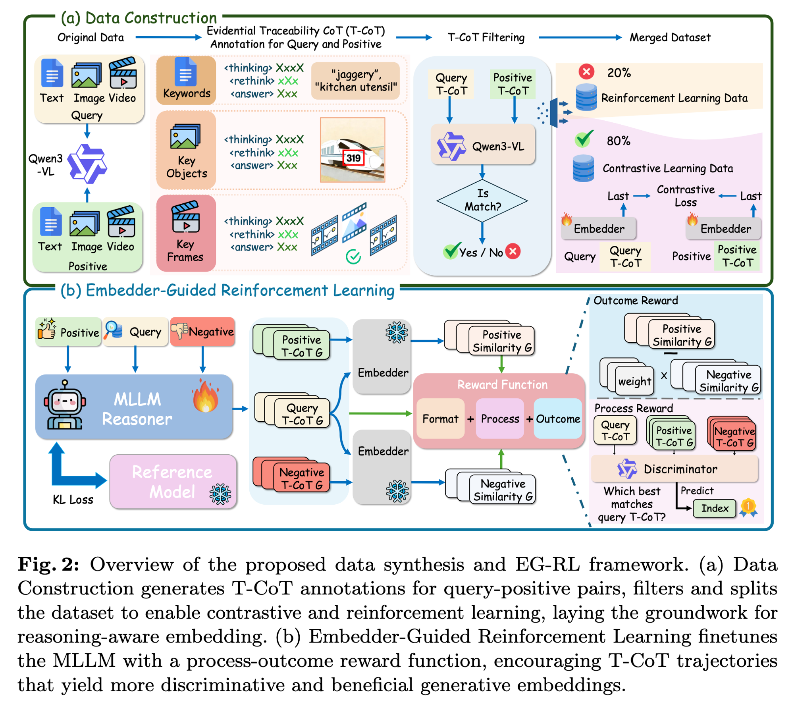
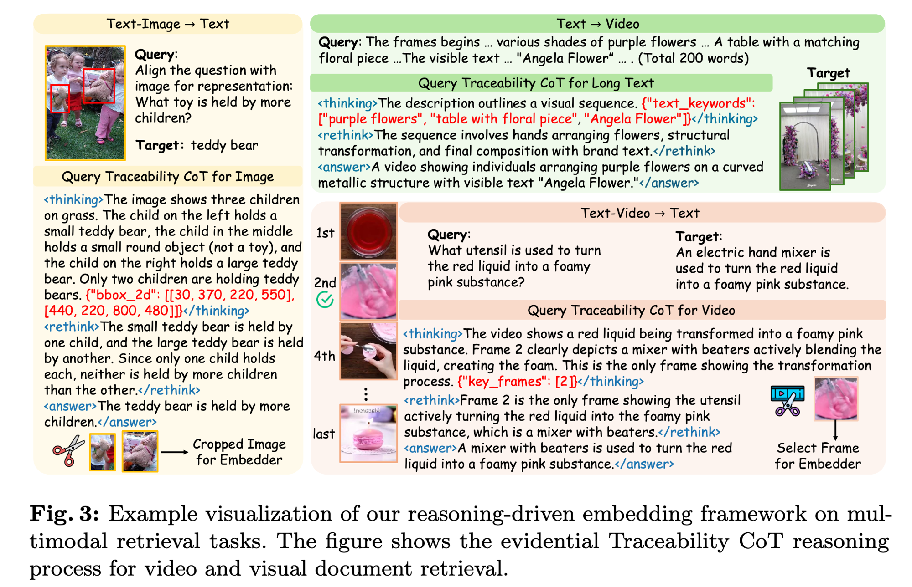
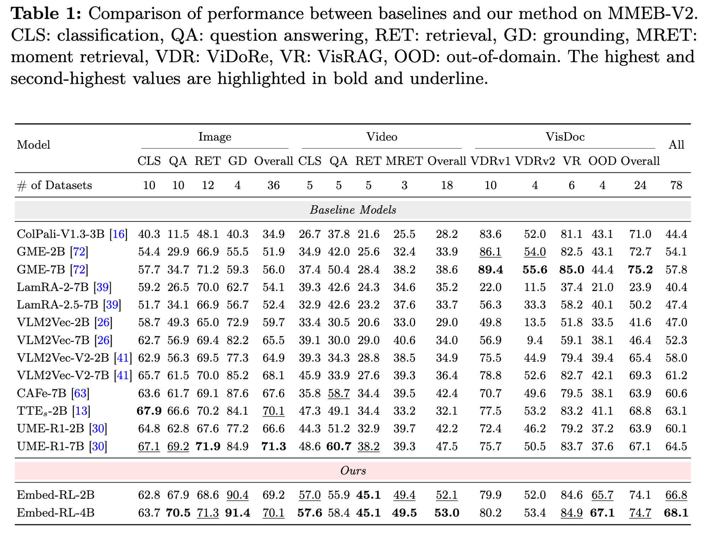
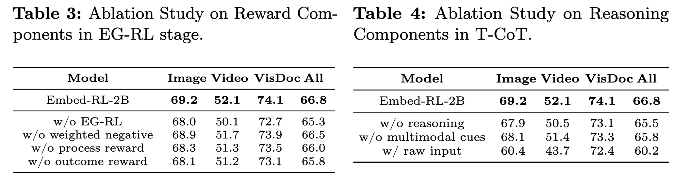
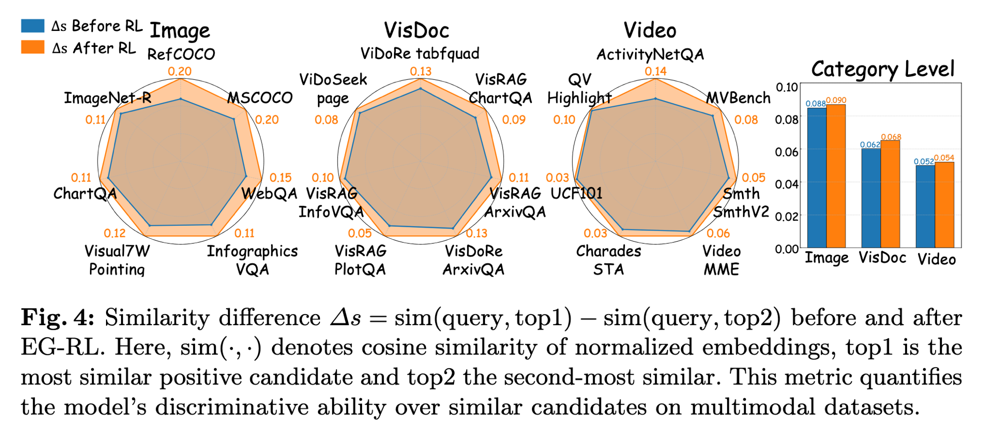
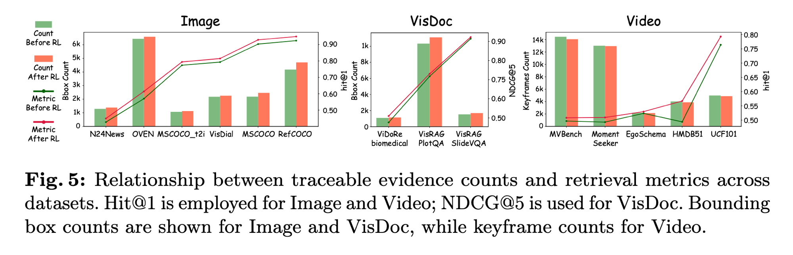
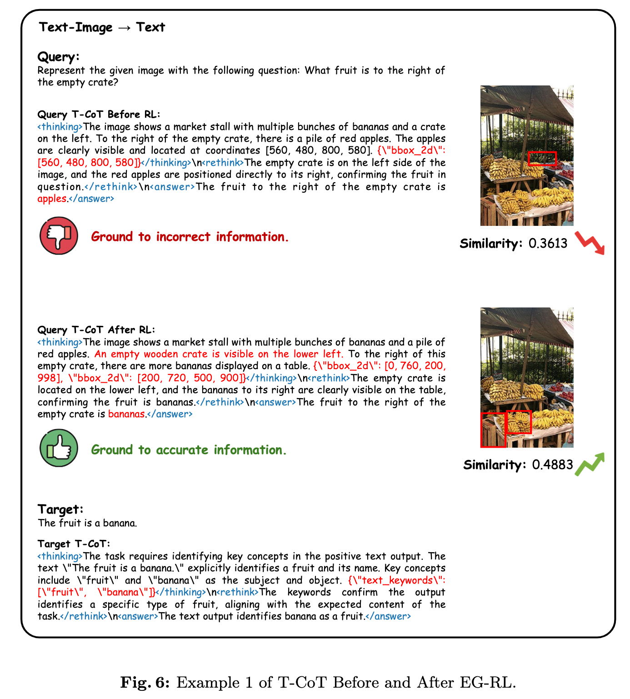

# Embed-RL: Reinforcement Learning for Reasoning-Driven Multimodal Embeddings —— 精读总结

> **论文标题**：Embed-RL: Reinforcement Learning for Reasoning-Driven Multimodal Embeddings
> **作者**：Haonan Jiang\*, Yuji Wang\*, **Yongjie Zhu**†(Project Leader), Xin Lu, Wenyu Qin, Meng Wang, **Pengfei Wan**, **Yansong Tang**‡(Corresponding)
> **机构**：Tsinghua Shenzhen International Graduate School（THU SIGS）+ **Kling Team, Kuaishou Technology**（快手可灵团队）；共一 Haonan Jiang / Yuji Wang 在快手 Kling 实习
> **会议/来源**：arXiv:2602.13823v3, 2026-03-12, cs.CV
> **关键词**：Multimodal Embedding · Generative Reasoning · Reinforcement Learning · GRPO · Universal Multimodal Embedding (UME)
> **代码/项目页**：论文 abstract 提到 "Project page" 但 PDF 里未给出确切 URL（实测 paper 的 arXiv 链接为 2602.13823v3）

---

## 作者背景

全员 **清华深圳国际研究生院（THU SIGS）+ 快手 Kling 团队** 联合署名。

- **Yansong Tang**（汤延松，清华 SIGS 通讯）：清华深研院助理教授，多模态视觉理解 + 视频理解方向；近年在 video grounding、video understanding 上多篇 CVPR/ICCV。
- **Pengfei Wan**（万鹏飞，快手 Kling Team）：快手视觉生成大模型负责人之一，**Kling AI** 视频生成模型主力作者。Kling Team 是国内视频生成第一梯队。
- **Yongjie Zhu**（朱永杰，Project Leader）：快手 Kling Team 核心研究员，本文的 driving force。
- 共一 Haonan Jiang & Yuji Wang：清华 SIGS 学生，在 Kling 实习期间完成本工作。

> 💡 **作者背景的潜在含义**：这是一篇 **学界 × 大厂视觉生成团队** 联合产出的 RL × MLLM Embedding 论文。Kling 团队过去主要做视频生成，这次转身做 **多模态检索 embedding** 是一个值得注意的信号——视频生成团队对"视频帧级理解"和"细粒度视觉 grounding"有天然优势，反映在本文的 T-CoT 设计里（key_frames 字段、bbox_2d 字段）。

---

## 1. 一句话总结（TL;DR）

Embed-RL 把 **多模态通用 embedding（UME）** 训练分成两阶段解耦：先用 InfoNCE 对比学习得到一个能打的 frozen Embedder，然后**用这个 frozen Embedder 当 reward model**、通过 GRPO 训练 Reasoner（Qwen3-VL-8B）生成 **检索导向的 Evidential Traceability CoT (T-CoT)**——T-CoT 强制输出 `text_keywords / bbox_2d / key_frames` 三类多模态线索字段，把图像/视频里的 RoI 切出来重新喂给 Embedder。在 MMEB-V2（78 任务）上，4B 模型 All=68.1，超过 7B 的 UME-R1 3.6 个点；UVRB 视频检索上 CG/FG/LC 三档全部 SOTA。

---

## 2. 研究动机

### 2.1 问题陈述：现有生成式 UME 的两个根本病



**图 1 解读** —— 这张图是全文 elevator pitch，分三块：

- **(a) 四种框架对比（左→右递进）**：
  1. **Discriminative Embedding**：直接把 visual+text token 喂 MLLM Embedder 取 last hidden（VLM2Vec、GME 一类），**不做生成式 reasoning**。
  2. **Generative Embedding**：MLLM Embedder 自己自回归生成 CoT 后再取 last（UME-R1 一类），**对比 loss 和 next-token loss 同时训会冲突**。
  3. **Decoupled Reasoner Embedding**：单独有一个 frozen MLLM Reasoner 生成 textual CoT，再喂 Embedder（TTE 一类），**Reasoner 是 off-the-shelf，CoT 跟检索目标对不齐、容易幻觉**。
  4. **EG-RL Embedding（本文）**：Reasoner 也训，**但用 frozen Embedder 反过来给 Reasoner 当 reward signal**，再加上 GRPO 把 Reasoner 的 CoT 推向"对检索有用"的方向，CoT 也升级为含 bbox/keyframe 的 **Evidential Traceability CoT**。
- **(b) RL 前后的 T-CoT 对比**：query "find a similar everyday image, change cola to orange soft drink"，**RL 前** Reasoner 死板地基于"图里没橙色瓶子"输出 `bbox_2d:[]` 然后说"找不到"——这种 CoT 对检索完全无用，相似度 0.5664；**RL 后** Reasoner 主动构造"应该找一个橙色软饮如 Fanta 在类似 advertising/产品展示 context"+ `bbox_2d:[120,100,320,500]`，相似度上升到 0.5977。
- **(c) 雷达图 Performance Comparison**：Embed-RL-4B（红线）在 13 个细分任务里 11 项最外、其中 V-QA / I-RET / V-RET / V-MR 等大幅领先 VLM2Vec-V2、UME-R1-7B、DUME-7B。

> ⭐ **关键洞察**：作者把"生成式 reasoning 帮助检索"这个看似简单的命题，分成两个**正交但都被忽略**的子问题：(1) **生成 vs 对比目标的梯度冲突**——只能解耦；(2) **CoT 内容 vs 检索目标的语义错位**——必须用 Embedder 反向 guide Reasoner。EG-RL 同时打这两个点。

### 2.2 三类已有方法的具体局限

| 范式 | 代表 | 病灶 |
|---|---|---|
| Discriminative | VLM2Vec, GME | 完全不利用 MLLM 的生成/推理能力，性能上限低 |
| Joint Generative | UME-R1 | InfoNCE + LM loss 梯度冲突，dilute 表征 |
| Decoupled (frozen reasoner) | TTE | Reasoner 不为检索 train，textual-only CoT 容易幻觉、错位、丢多模态线索 |

**现有 CoT 的最大盲点**：CoT 全是 textual——没有显式定位图像 RoI、没有视频 keyframe、没有抽 query 关键词，**视觉-空间线索和视频-时序线索完全没用上**。本文 T-CoT 直接补这块。

### 2.3 核心切入点

1. **解耦 + RL**：让 Embedder 先 frozen 成为稳定的 reward model（避免 reward hacking），然后用它训 Reasoner，policy 优化用 GRPO（参考 DeepSeek-R1-Zero 的 paradigm）。
2. **T-CoT 强 schema**：CoT 里强制输出三类多模态线索字段（`text_keywords` / `bbox_2d` / `key_frames`），并且**根据 bbox 重 crop 图、根据 keyframe 重选视频帧**作为 Embedder 的额外输入——CoT 不仅是文本，还反过来调制 Embedder 的视觉输入。
3. **Process + Outcome 双奖励**：除了对齐型 Outcome reward，还加一个 **VLM Discriminator 做 listwise 选择题** 的 Process reward——把 m 个 candidate 的 t_cot 打乱，让 Discriminator 从中选与 q_cot 最对齐的，命中 ground truth 才给 reward=1。这是个挺巧妙的过程奖励 framing。

---

## 3. 方法详解



**图 2 解读** —— 整张图分上下两块：

- **(a) Data Construction（上）**：Original Data（text/image/video query + positive 各一份）→ 喂 **Qwen3-VL** 自动标注 T-CoT，输出包含 `<thinking>/<rethink>/<answer>` 三段，并附带 `Keywords` / `Key Objects (bbox)` / `Key Frames` → **T-CoT Filtering**：把 query T-CoT 和 positive T-CoT 一起再喂 Qwen3-VL，问"is match?"，No 的扔掉、Yes 的保留 → 切 80/20：**80%→ Contrastive Learning Data**（用来 InfoNCE 训 Embedder），**20%→ Reinforcement Learning Data**（用来 GRPO 训 Reasoner，作者特意把 filter 掉的 hard sample 也回收一部分进 RL 池）。
- **(b) Embedder-Guided Reinforcement Learning（下）**：MLLM Reasoner 接 Positive/Query/Negative triplet → 生成 Positive T-CoT G、Query T-CoT G、Negative T-CoT G（G 表示一组 G=8 候选）→ 三路并行喂 Embedder（**Embedder frozen**，只有 Reasoner train）→ 算 Positive Similarity G 和 Negative Similarity G → Reward Function = Format + Process + Outcome → 拿 advantage 反传更新 Reasoner，同时跟 Reference Model 做 KL。
  - **Outcome Reward**（图右上）：weight × Negative Similarity G + Positive Similarity G 的margin
  - **Process Reward**（图右下）：把 Query T-CoT、Positive T-CoT G、Negative T-CoT G 喂给 **VLM Discriminator**，问"哪个最匹配 query T-CoT"，要求选中 ground truth index 才给 reward。

### 3.1 Stage 1：Embedder 对比预训练

#### 这一步在干什么
用标准 InfoNCE 训一个能打的 multimodal Embedder（基于 Qwen3-VL-2B/4B），让它具备"看到 query+T-CoT，输出有判别力的 last-token embedding"的基础能力。**Stage 1 训完后 Embedder 完全 frozen**，进入 Stage 2 当 reward model。

#### 损失公式

$$
\mathcal{L}_{\text{InfoNCE}} = -\frac{1}{N}\sum_{i=1}^{N}\log\frac{\exp(\cos(h_{q_i}, h_{t_i^+})/\tau)}{\exp(\cos(h_{q_i}, h_{t_i^+})/\tau) + \sum_{t^-\in\mathcal{T}^-}\exp(\cos(h_{q_i}, h_{t^-})/\tau)}
$$

**直觉理解**：标准对比学习——拉近 query 和正样本的 last-token 表征，推远 in-batch 负样本。`τ` 是温度，论文设 0.01 偏小，意味着对比信号比较"硬"。embedding 取自 last-layer 的 last token 隐状态。

#### 训练数据
- **Image**：MMEB-train（cls / QA / retrieval / grounding 都覆盖）
- **Video**：LLaVA-Hound（caption / QA / retrieval）
- **VisDoc**：ViDoRe + VisRAG
- 初始 2.22M 样本 → Qwen3-VL filter "yes/no match" → 保留 1.83M (~80%)。**80% 给 Embedder 做 contrastive，剩下 20% 是被 filter 掉的"难样本"，转给后面的 RL 阶段做探索**——这个数据回收策略挺务实。

### 3.2 Stage 2：Embedder-Guided RL（EG-RL）训 Reasoner

#### 这一步在干什么
冻结 Stage 1 的 Embedder，在它顶上接一个 trainable Reasoner（Qwen3-VL-8B），让 Reasoner 学会生成对检索有用的 T-CoT。Reward 完全来自 frozen Embedder（embedding 对齐度）+ 一个独立的 VLM Discriminator（process 选择题命中率）+ 格式合规。

#### Embedder 的输入构造

$$
\mathcal{I} = [x_{\text{text}},\ x_{\text{img}},\ x_{\text{vid}},\ \text{T-CoT}(x),\ \langle\text{emb}\rangle]
$$

**直觉理解**：把原始的 text/image/video token、Reasoner 生成的 T-CoT 序列、一个特殊的 `<emb>` token 拼成一个长输入，过 Embedder 后取 `<emb>` 那个位置的 hidden state 作为最终 embedding。**T-CoT 不只是文本——还会按其中的 bbox 重 crop 原图、按 key_frames 重选视频帧，把 cropped 视觉内容补回输入**（见图 3 右上）。

#### Reward 三件套

**1) Format Reward** ($\mathcal{R}_{\text{format}}$)：T-CoT 是否严格遵循 `<thinking>→<rethink>→<answer>` 三段式 + 是否输出了对应模态的 cue 字段。1/0 二元。

**2) Outcome Reward**（embedder-guided）：

$$
\mathcal{R}_{\text{outcome}}(o_i^q) = \text{Acc}_k(e_{q_i}, e_{t_i^+}) \cdot \big(\text{sim}(e_{q_i}, e_{t_i^+}) - \mathbb{E}_\tau[\text{sim}(e_{q_i}, e_{t_j^-})]\big)
$$

**直觉理解**：
- $\text{Acc}_k$：top-k 检索准确度（正样本是否在 top-k 里），是个 gate——没排进去就 0 分，排进去才看 margin。
- 后面那项是 **正样本 cosine 减掉所有负样本 cosine 的 softmax-加权平均**，等于"margin"，越大越好。
- 对称计算：把 $t_i^+$ 当 anchor、$q_i$ 当 positive、其他 in-batch query 当 negative，再算一遍 $\mathcal{R}_{\text{outcome}}(o_i^t)$，强迫 query→target 和 target→query 两个方向都要对齐。

**3) Process Reward**（VLM Discriminator listwise 选择题）：

$$
\mathcal{R}_{\text{process}}(o_i) = \begin{cases} 1, & \text{if } \mathcal{D}(q_{\text{cot}}, \{c_{\text{cot}}^j\}_{j=1}^m) \in \mathcal{P} \\ 0, & \text{otherwise} \end{cases}
$$

**直觉理解**：拿一个独立 frozen 的 VLM Discriminator $\mathcal{D}$，给它 query 的 T-CoT 和 m 个候选的 T-CoT（含 ground-truth positive 们 + 别的负样本），**打乱顺序**让它从中选最匹配 q_cot 的 index。如果选中的 index 落在 ground-truth set $\mathcal{P}$ 里就 reward=1，否则 0。**等于把 process supervision 转成一个 listwise 选择题**——比让 LLM 直接打分更鲁棒、不容易 reward hacking。同样对称地对 target 方向再算一次。

**总奖励**：

$$
\mathcal{R}_{\text{total}} = \alpha\mathcal{R}_{\text{format}} + \beta\mathcal{R}_{\text{process}} + \gamma\mathcal{R}_{\text{outcome}}
$$

#### Policy Optimization：GRPO

$$
\mathcal{L}_{\text{grpo}} = \mathbb{E}_{q\sim\mathcal{S},\ \{o_i\}\sim\pi_{\theta_{\text{old}}}}\Big[\frac{1}{G}\sum_{i=1}^G \big(\min(r_\theta(o_i)A_i,\ \text{clip}(r_\theta(o_i),1-\epsilon,1+\epsilon)A_i) - \beta\mathbb{D}_{\text{KL}}(\pi_\theta\|\pi_{\text{ref}})\big)\Big]
$$

**直觉理解**：标准 DeepSeek-style GRPO——每个 query 采样 G=8 条 T-CoT 候选，按组内 reward 算 advantage $A_i = (r_i - \mu_r)/\sigma_r$，拿 PPO-style clipped objective + KL 约束更新 policy。**没有 critic / value model**，纯 group-relative 比较，这是 GRPO 相比 PPO 最省资源的地方。

> ⭐ **关键设计 1**：**Embedder frozen 后做 reward model** —— 既保证 reward 信号稳定（不会随训练 drift），又规避了 InfoNCE/LM 双 loss 梯度冲突。这是 EG-RL 的命名来源。
>
> ⭐ **关键设计 2**：**T-CoT 不只是文本，会反过来 modulate Embedder 输入** —— bbox 用来 crop 图，keyframe 用来选视频帧。这把"reasoning 改善 retrieval"从纯文本层面提到 **多模态层面**。
>
> ⚠️ **易踩的坑**：如果 Embedder 没先训好就上 RL，reward 信号会很糙、Reasoner 学到一堆奇怪 pattern。本文必须先 80% 数据 InfoNCE pretrain，才能进 RL。

### 3.3 T-CoT 三段式格式 + 多模态 cue 字段

每条 T-CoT 严格遵守：

```
<thinking> {模态特定的初步分析 + 抽 cue 字段} </thinking>
<rethink>  {基于 cue 重新审视、修正错误} </rethink>
<answer>   {精炼后的 retrieval-oriented 描述} </answer>
```

cue 字段按模态分化：

| 模态 | cue 字段 | 用途 |
|---|---|---|
| Text | `text_keywords`: ["关键词1", "关键词2"] | 抽 query 关键词，对长文本特别有用 |
| Image | `bbox_2d`: [x1,y1,x2,y2] | 定位 RoI，cropped 图回喂 Embedder |
| Video | `key_frames`: [2, 5, 7] | 选关键帧 index，selected frames 回喂 Embedder |



**图 3 解读** —— 三个 case 演示 T-CoT 的多模态 grounding 能力：

- **左：Text-Image → Text**：query "What toy is held by more children?" + 三个小孩抱玩具的图。T-CoT thinking 里描述"左边小孩抱小泰迪、中间小孩抱圆物（不是玩具）、右边小孩抱大泰迪"+ 输出两个 bbox（30,370,220,550 和 440,220,800,480）→ rethink 里 "small/large 泰迪各被 1 人抱，所以 neither held by more children"→ answer 给 "The teddy bear is held by more children"。**bbox 切出来的 cropped image 重新喂 Embedder**。
- **右上：Text → Video**：query 是 200 词的 long text describing 紫色花、桌子、品牌 "Angela Flower"。T-CoT thinking 里抽出 `text_keywords:["purple flowers","table with floral piece","Angela Flower"]`→ 等于把超长描述压缩成几个高密度关键词，对长文本检索效果好。
- **右下：Text-Video → Text**：query "什么 utensil 把红液变成 foamy pink"，5 帧视频。T-CoT thinking 里说 frame 2 清晰显示 mixer 在 blend → 抽出 `key_frames:[2]`→ 只把 frame 2 回喂 Embedder。**这种 single-frame focus 在 video QA 上比 uniform sampling 对齐目标精确得多**。

> 💡 **观察**：bbox / keyframe 的 cropped 视觉内容会**和原图/原视频一起**喂 Embedder（不是替换），等于给 Embedder 一个 "整体 + RoI 局部" 的双视角。

---

## 4. 实验设置

| 项 | 值 |
|---|---|
| Embedder backbone | **Qwen3-VL-2B / Qwen3-VL-4B**（LoRA 微调） |
| Reasoner backbone | **Qwen3-VL-8B**（GRPO） |
| Discriminator (process reward) | 独立预训练 VLM（论文未详细列名，但流程图标注为 Qwen3-VL） |
| Embedder 训练 | 2 epochs，lr=1e-4，weight decay=0.01，batch=512(2B)/256(4B)，DeepSpeed Zero2 |
| Reasoner 训练 | 1 epoch（!），lr=3e-6，batch=256，G=8 candidates per query，标准 GRPO 超参 |
| 训练数据 | 1.83M（80% contrastive）+ ~440K（20% RL） |
| 数据来源 | MMEB-train（image）+ LLaVA-Hound（video）+ ViDoRe & VisRAG（visdoc） |
| Eval benchmark 1 | **MMEB-V2**：78 任务跨 image/video/visdoc 三模态 |
| Eval benchmark 2 | **UVRB**：16 视频检索数据集，覆盖 CG/FG/LC 三档 |
| 主指标 | Hit@1（image/video）、NDCG@5（visdoc）、mAP（UVRB） |

> 📘 **MMEB-V2 入门解读**：MMEB（[arXiv:2410.05160]）原版 36 个 image 任务，V2 升级到 78 任务、扩到 image (36) + video (18) + visdoc (24)。是当前最综合的多模态 universal embedding benchmark。
>
> 📘 **UVRB 入门解读**：Universal Video Retrieval Benchmark，16 个数据集，按 Coarse-grained（粗粒度活动级）/Fine-grained（细粒度动作级）/Long-context（长视频）三档评估。CG/FG/LC 全打的模型才说明视频理解全栈过关。

---

## 5. 主要实验结果

### 5.1 MMEB-V2 主表（Table 1）



**关键数据摘录**（Embed-RL-4B 是 All=68.1 第一名）：

| 模型 | Image-Overall | Video-Overall | VisDoc-Overall | **All** |
|---|---:|---:|---:|---:|
| ColPali-V1.3-3B | 34.9 | 28.2 | 71.0 | 44.4 |
| GME-7B | 56.0 | 38.6 | **75.2** | 57.8 |
| LamRA-2-7B | 54.1 | 35.2 | 23.9 | 40.4 |
| VLM2Vec-V2-7B | 68.1 | 36.4 | 69.3 | 61.2 |
| CAFe-7B | 67.6 | 42.4 | 63.9 | 60.6 |
| TTE_s-2B | 70.1 | 32.1 | 68.8 | 63.1 |
| UME-R1-2B | 66.6 | 42.2 | 63.9 | 60.1 |
| UME-R1-7B | **71.3** | 47.5 | 67.1 | 64.5 |
| **Embed-RL-2B (Ours)** | 69.2 | **52.1** | 74.1 | **66.8** |
| **Embed-RL-4B (Ours)** | **70.1** | **53.0** | **74.7** | **68.1** |

**关键发现**：

1. **Embed-RL-4B All=68.1，超过最强 baseline UME-R1-7B 3.6 个点，且模型规模更小（4B vs 7B）**——这是非常硬的对比：相同 Reasoner 思路（UME-R1 也是 reasoning-driven embedding），加上 Embed-RL 的解耦 RL + 多模态 T-CoT，**用一半参数实现明显领先**。
2. **Video 提升最显著**：Embed-RL 在 Video Overall 拿 53.0，比第二名 UME-R1-7B 的 47.5 高 5.5 个点，比 GME-7B（38.6）高 14.4 点。Video-RET 和 Video-MRET 是断档式领先（45.1 / 49.5 vs 第二名 38.2 / 40.6）。**直接归功于 T-CoT 的 keyframe 字段**——video 任务被多帧 noise 拖累最严重，能精确选关键帧的模型大赢。
3. **VisDoc OOD 第一**：67.1（4B）vs 第二 GME-2B/V2-2B 都是 43.x → 44.x，**+22 点**，这直接说明 T-CoT 对 OOD 泛化大有帮助。
4. **Image-GD（grounding）91.4**：Image-GD 是细粒度定位任务，bbox_2d 字段直接打到 grounding 任务的甜点上。
5. **Embed-RL-2B（66.8）已经超过所有 baseline 的最强模型（UME-R1-7B=64.5）**，说明本方法的核心收益不靠规模，靠机制。

### 5.2 UVRB 视频检索（Table 2）

| 模型 | CG（粗） | FG（细） | LC（长视频） |
|---|---:|---:|---:|
| InternVideo2-6B | 50.4 | 41.7 | 42.3 |
| VLM2Vec-V2 | 49.8 | 50.2 | 76.2 |
| GME-7B | 51.8 | 50.7 | 78.8 |
| Unite-7B | 54.1 | 53.9 | 74.6 |
| GVE-3B | 55.2 | 54.1 | 76.4 |
| **Embed-RL-2B** | 59.1 | 54.6 | **86.9** |
| **Embed-RL-4B** | **60.7** | **55.6** | 86.1 |

**关键发现**：UVRB 三档全部 SOTA。**LC（long context video）+11 点**是最大亮点——长视频检索一直是难题，T-CoT 的 keyframe focus 是直接对症下药。

---

## 6. 消融研究



### 6.1 Reward 组件消融（Table 3，Embed-RL-2B baseline = 66.8）

| 变体 | Image | Video | VisDoc | **All** | Δ |
|---|---:|---:|---:|---:|---:|
| **Embed-RL-2B (full)** | **69.2** | **52.1** | **74.1** | **66.8** | — |
| w/o EG-RL（不做 RL，只 stage 1） | 68.0 | 50.1 | 72.7 | 65.3 | **−1.5** |
| w/o weighted negative | 68.9 | 51.7 | 73.9 | 66.5 | −0.3 |
| w/o process reward | 68.3 | 51.3 | 73.5 | 66.0 | −0.8 |
| w/o outcome reward | 68.1 | 51.2 | 73.1 | 65.8 | −1.0 |

**关键发现**：
- **去掉 RL 阶段直接 −1.5（最大单项）**——证明 RL 阶段不是 marginal 加成，是关键贡献。
- **去掉 process reward 在 Video 上掉 0.8**（52.1→51.3）—— process reward 主要对 video 有用，因为 video T-CoT 的 step-by-step alignment 更关键。
- **去掉 outcome reward 掉 1.0** —— 比 process reward 影响大一点，符合直觉（outcome 是直接对齐 retrieval target 的）。
- **weighted negative 只贡献 0.3** —— 是 nice-to-have，不是 must-have。

### 6.2 T-CoT Reasoning 组件消融（Table 4）

| 变体 | Image | Video | VisDoc | **All** | Δ |
|---|---:|---:|---:|---:|---:|
| **Embed-RL-2B (full T-CoT)** | **69.2** | **52.1** | **74.1** | **66.8** | — |
| w/o reasoning（去 thinking/rethink，只留 answer） | 67.9 | 50.5 | 73.1 | 65.5 | −1.3 |
| w/o multimodal cues（去 bbox / keyframe） | 68.1 | 51.4 | 73.3 | 65.8 | −1.0 |
| **w/ raw input（完全没 T-CoT）** | 60.4 | 43.7 | 72.4 | 60.2 | **−6.6** |

**关键发现**：
- **`w/ raw input` 暴跌 6.6**，Video 直接从 52.1 掉到 43.7（−8.4）——这说明 **T-CoT 是核心引擎**，不是装饰。生成式 reasoning 对 retrieval 是真有用，前提是 reasoning 内容本身对齐到检索目标（这正是 EG-RL 在做的事）。
- **去掉 multimodal cues（bbox/keyframe）掉 1.0** —— 多模态字段比单纯文字 reasoning 多 1 个点的增益。
- **去 thinking/rethink 掉 1.3** —— 三段式结构本身有价值，不能直接给 answer。

### 6.3 区分能力分析（Fig 4）



**图 4 解读** —— 三组雷达图分别是 Image / VisDoc / Video，每个角是一个数据集，半径是 Δs（query 到 top1 与 top2 的相似度差，越大区分能力越强），蓝色是 RL 前、橙色是 RL 后。
- **三个雷达图的橙色都完全包络蓝色**——RL 没有伤害任何一个数据集的区分力。
- **类目级聚合（最右柱状图）**：
  - Image：0.088 → 0.090 (+2.3%)
  - VisDoc：0.062 → 0.068 (+9.7%)
  - Video：0.052 → 0.054 (+3.8%)
- VisDoc 的提升最显著——visdoc OOD 任务也是 +20+ 点的来源。

> 💡 **观察**：作者额外做了"top1 vs top2 间距"分析而不是只看 Hit@1，意义在于**显示 Embedder 不仅仅是"猜对了"还把正样本和最像的干扰项明显拉开**——这对真实 deployment 里 ranking head 很重要（推荐系统里 top1/top2 间距太小会让排序变得脆弱）。

### 6.4 可追溯证据数 vs 检索指标（Fig 5）



**图 5 解读** —— 三块分别是 Image / VisDoc / Video，柱状是 bbox（image/visdoc）或 keyframe（video）的数量，折线是对应的 hit@1（image/video）或 NDCG@5（visdoc）。
- **Image 数据集**：RL 后 bbox count **普遍增多**（OVEN、RefCOCO、MSCOCO 都涨），hit@1 也跟着涨。**意味着 RL 教会 Reasoner "多框几个 RoI" 来覆盖更全的视觉证据**。
- **VisDoc**：bbox count 在 VisRAG-PlotQA、VisRAG-SlideVQA 大幅上升，NDCG@5 同步大涨。
- **Video**：keyframe count 反而**减少**（MVBench、Moment Seeker 略降）但 hit@1 上升。**即 video 模态学会了 "更聚焦 1-2 个 critical frame"，这跟 image 是相反的策略**——image 要"多看几处"，video 要"聚焦关键帧"。
- 作者的解释：image/visdoc 是"多目标定位"问题，需要 bbox 多；video 是"找关键事件帧"问题，需要 keyframe 少而精。

> ⭐ **重要洞察**：这张图是**模态特异性的最强证据**——同样的 RL 训练，不同模态学到的策略是反向的（多 vs 少），证明 reward 信号有效引导 Reasoner 学到模态正确的 inductive bias。

### 6.5 Case Study（Fig 6）



**图 6 解读** —— Query: "What fruit is to the right of the empty crate?"，target answer "banana"。
- **RL 前**：Reasoner 错误地把 bbox 框到了红苹果上 [560,480,800,580]，answer "apples" → similarity 0.3613，**ground 错地方**。
- **RL 后**：Reasoner 精确识别 "empty wooden crate is on the lower left"，框出空 crate（[0,760,200,998]）和 banana 区域（[200,720,500,900]），answer "bananas"→ similarity 0.4883（+0.127），**ground 对了**。
- Target T-CoT（最下方）也展示了 target 侧 T-CoT 的标注样式：抽出 `text_keywords:["fruit","banana"]`。

**这个 case 直接说明**：EG-RL 修正的是 **空间 grounding 错误**——RL 前模型 "knows the words" 但 "doesn't see the right region"，RL 后空间-语义对齐了。

---

## 7. 创新点小结

1. **EG-RL 解耦 RL 框架**：先 contrastive 训 Embedder → frozen 后当 reward model → 用 GRPO 训 Reasoner 生成检索导向 T-CoT。是 UME-R1（联合训）和 TTE（frozen reasoner）之外的"第三条路"。
2. **Evidential Traceability CoT (T-CoT)**：三段式 + 三类多模态 cue 字段（text_keywords / bbox_2d / key_frames），CoT 不只是文本，**还反向 modulate Embedder 的视觉输入（cropped 图、selected frames）**。
3. **Process + Outcome 双奖励 + VLM Discriminator listwise 选择题**：Process reward 用 "shuffle 候选 + Discriminator 选最匹配的" 这个 framing，比直接打分鲁棒，规避 reward hacking。
4. **80/20 数据切分**：filter 留下的高质量给 contrastive，filter 掉的 hard sample 回收给 RL 探索——简单但务实的数据资产分配。
5. **效率红线**：**Embedder 用 LoRA + 2B/4B、Reasoner 用 8B + 1 epoch GRPO**，整体训练成本远低于 7B 联合训方法，证明规模不是 SOTA 的必要前提。

---

## 8. 局限与未来方向

- **Reasoner 是 8B（Qwen3-VL-8B），实际部署时每个 query 都要 forward 一次 Reasoner 生成 T-CoT，inference cost 显著高于纯 Embedder 方案**。论文没讨论 latency。
- **T-CoT 由 Qwen3-VL 自动标注做 SFT 起点 + filter，仍然依赖外部强 VLM 的标注质量**——如果换到一个 Qwen3-VL 不擅长的领域（医疗影像、CAD 图），冷启动会有问题。
- **Process Reward 用的 Discriminator 是另一个独立 VLM，引入额外计算 + 这个 D 本身可能 bias**（论文没消融 D 的选择敏感性）。
- **数据收集只做 image/video/visdoc 三模态；audio、3D、structured table 等没碰**。
- **T-CoT 的 schema 是手工设计的（thinking/rethink/answer + 三类 cue 字段）——能否让 RL 自己 emerge 出更好的 schema 是下一个方向**。

---

## 9. 与近期相关工作的横向对比

| 论文 | 思路 | Reasoner | Embedder | RL? | 多模态 cue |
|---|---|---|---|---|---|
| VLM2Vec(-V2) [26,41] | discriminative | — | trainable | ❌ | ❌ |
| LamRA [39] | 两阶段 + joint rerank | — | trainable | ❌ | ❌ |
| GME [72] | 模态平衡数据 | — | trainable | ❌ | ❌ |
| UME-R1 [30] | joint generative + RL | trainable | trainable（=Reasoner） | ✅（联合） | textual only |
| TTE [13] | decoupled, frozen reasoner | **frozen** | trainable | ❌ | ❌ |
| **Embed-RL（本文）** | **decoupled + EG-RL** | **trainable via RL** | **frozen after stage 1** | ✅（GRPO） | **bbox + keyframe + keywords** |

> ⭐ **本文的差异化定位**：在"训不训 Reasoner"和"用什么对齐 Reasoner"两个轴上，**它选了"训 Reasoner、用 frozen Embedder 当 reward"**，这是 UME-R1 和 TTE 中间的最优解——避免联合训的梯度冲突，又不让 Reasoner 一直 frozen 与目标错位。

---

## 10. 对当前调研主题的启发 ⭐

> 示例：假设你的调研方向是 **multimodal retrieval / agent-style search / reasoning + RL on embeddings** 中的任一条，可以怎么把本文的设计搬到你的工作里。把下面"你的工作 / 你的场景"替换成你的实际项目即可。

### 10.1 直接可借鉴的设计

1. **T-CoT 的 schema 可作多模态 SFT 的现成蓝图** ⭐⭐⭐
   - 如果你的调研里有一项是"如何让 reasoning trace 利用上图像/视频信息"，Embed-RL 的 `text_keywords / bbox_2d / key_frames` 三字段就是一个非常 actionable 的 schema。
   - **可直接搬到你的多模态 SFT 数据格式里**：thinking 段强制输出 cue 字段、rethink 段做反思、answer 段给最终描述。
   - 比"textual-only CoT"更具传递力。

2. **解耦 + frozen Embedder 当 reward** ⭐⭐⭐
   - 多模态训练里 reward 信号不稳是常见痛点。Embed-RL 的方案：**先用 contrastive 把 Embedder 训好 → frozen → 当 reward source** —— 这个 paradigm **可迁移到任何 retriever-reasoner 协同训练场景**。
   - 跟"从 agent trajectory 反推 retriever 监督"那类工作（如 LRAT 等）形成有趣对比：方向相反，但都解决 retriever-reasoner 协同问题，**可以组合**。

3. **Process Reward = Discriminator listwise 选择题** ⭐⭐
   - 用一个独立 VLM 当 judge 是常见做法，但 "shuffle 候选 + 选 top-k 命中" 这个 framing 比直接打分（"给 0~10 分"）抗 reward hacking 强很多。
   - **任何用 LLM-as-judge 做多模态 RL 的场景都可以照搬**：把多个 trajectory 的 reasoning trace 打乱让 LLM 选 "哪个最匹配 query"，命中正样本 index 才给 reward。

4. **80/20 数据切分（高质量给 SFT、filter 掉的硬样本给 RL）** ⭐
   - 简单、务实、可立即迁移到任何 reasoner 训练流程：filter 阶段不要扔掉所有 noisy data，留 20% 给 RL 阶段做探索。

### 10.2 不直接迁移但启发性强的点

5. **bbox / keyframe 反向 modulate Embedder 视觉输入**：图文检索方向可以借鉴"把 RoI cropped 区域和原图一起 forward Embedder" 的思路，给 Embedder 一个 "整体 + 局部" 双视角。

6. **Image 多 bbox vs Video 少 keyframe 的反向策略**：从 Fig 5 看出 RL 自己学出来的 —— 这给多模态评测一个提示：**不同模态下"证据应该多还是少"是数据决定的，不要一刀切**。

### 10.3 跟你方向可能的差异（不要照搬的部分）

- **Embed-RL 是为 universal multimodal embedding 优化的，不是 agentic search** —— 它的 query 是单 turn 的（描述一张图、一段视频），不是 agent 的多轮交互。agentic 场景下 trajectory 监督和它的 single-turn query+positive 训练形态本质不同。
- **Reasoner 8B 的 inference cost 在 agentic search（多轮调用）下会被放大很多倍** —— 搬过来要考虑用更小 Reasoner 或者只在 query rewriting 阶段调用一次。
- **它的 benchmark（MMEB-V2 / UVRB）是 retrieval-only 的**，不是 end-to-end agentic task success rate。end-to-end 评测要看 InfoSeek-Eval / BrowseComp-Plus 这种 agentic benchmark，不能只看 retrieval metrics。

### 10.4 落地建议（示例 —— 替换为你自己的调研主题）

1. **如果你在做多模态 SFT 数据 schema 设计**，优先采用 T-CoT 三段式 + cue 字段，是低成本高 ROI 的改造。
2. **如果你在做多模态 RL**，reward 设计可以借鉴 EG-RL 的 process+outcome 双奖励 —— 用 frozen multimodal retriever 当 outcome reward 来源，用 LLM-as-judge 做 process reward 的 listwise 选择题。
3. **如果你的数据 pipeline 跑在云存储上**，bbox/keyframe 抽取建议预处理一次写到原数据里，避免每次训练都跑视觉模型。
4. **跟 retriever-trajectory-supervision 类工作（如 LRAT）的组合思路值得探索**：能不能在 agentic 训练上**同时做两件事**（retriever 用 trajectory 训、reasoner 用 frozen retriever guide）？这是一个潜在的 contribution hook，但 empirical-first：先把单边 baseline 跑通再说。

---

## 附录 A：阅读时记录的若干疑问

1. **Q: Discriminator 用的是哪个 VLM？** —— 论文方法节说"独立预训练 VLM"，但流程图标注 Qwen3-VL，没明确是 7B 还是 8B 还是其他规模。可能在 supplementary 里。
2. **Q: G=8 候选采样的多样性如何保证？** —— GRPO 一组 8 条 T-CoT 如果几乎一样，advantage 会接近 0、训练 stall。论文没讨论 sampling 温度的 schedule。
3. **Q: Format reward 是 hard 1/0 会不会让训练初期梯度稀疏？** —— 没看到 warm-up。考虑 Reasoner 用的是 Qwen3-VL-8B（比较强），从一开始格式应该就不会差太远。
4. **Q: 推理时还需要 Reasoner forward 吗？** —— 是的（必需 T-CoT）。这意味着实际 deployment 是 "Reasoner-8B forward + Embedder-2B/4B forward"，cost 不低。
5. **Q: 跟纯 Embedder + 一个外挂 reranker 比哪个性价比高？** —— 论文没做这个对比。

